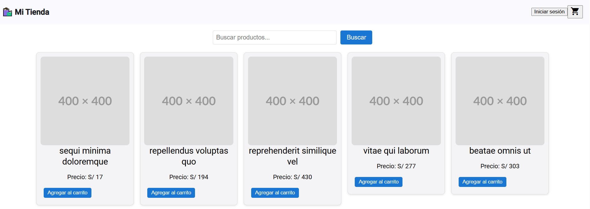
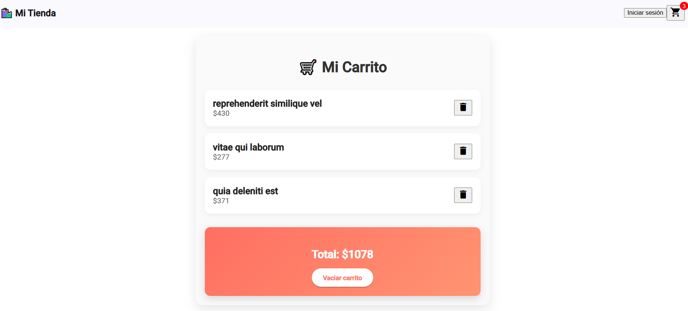

# 🛍️ Front E-commerce Angular

[](https://angular.io/)  
[](LICENSE)  
[](https://github.com/fericell2909/front-ecommerce)

¡Bienvenido al proyecto **Front E-commerce**! 🚀  
Este es un frontend para una tienda online hecho en **Angular**, diseñado para ofrecer una experiencia de compra moderna, rápida y atractiva.

---

## 📦 Características principales

✅ Visualización de productos con **paginación** e **infinite scroll**  
✅ Búsqueda de productos en tiempo real  
✅ Carrito de compras dinámico con contador actualizado en el header  
✅ Notificaciones tipo **snackbar** cuando agregas productos al carrito  
✅ Autenticación de usuarios: login, logout, guardado de carrito en backend  
✅ Rutas protegidas con **AuthGuard**  
✅ UI responsiva y limpia usando **Angular Material**  

---

## 🛠️ Tecnologías usadas

- Angular 17+
- Angular Material
- RxJS
- TypeScript
- HTML + SCSS
- Backend (esperado): API REST con autenticación JWT

---

## ⚙️ Cómo correrlo localmente

1️⃣ Clona el repositorio:
```bash
git clone https://github.com/fericell2909/front-ecommerce.git
cd front-ecommerce

## 📸 Screenshots

| 🖼 Pantalla principal | 🛒 Carrito de compras |
|-----------------------|----------------------|
|  |  |

